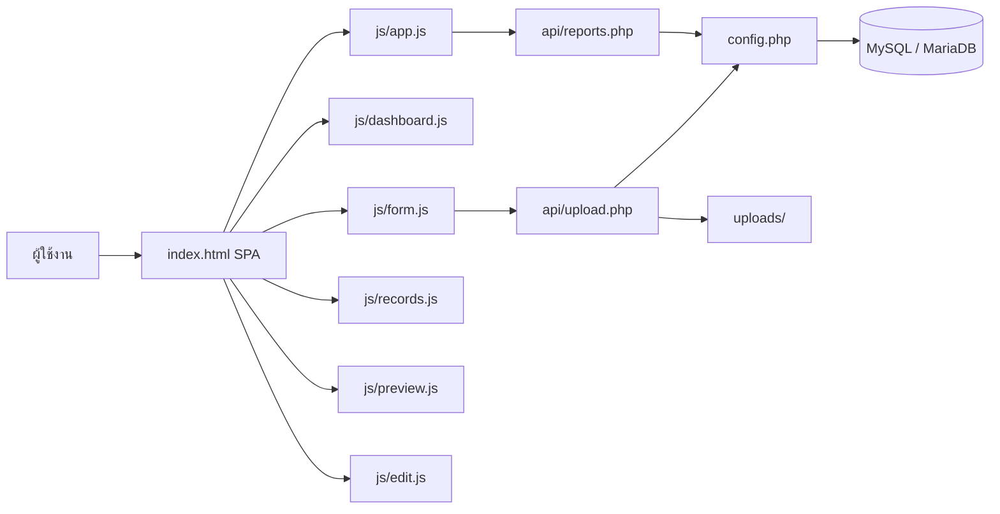
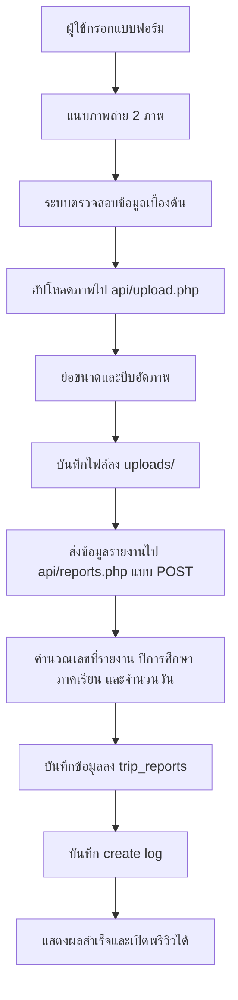
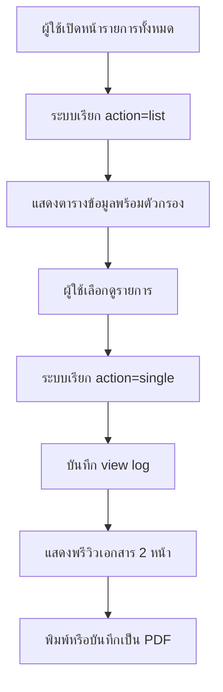
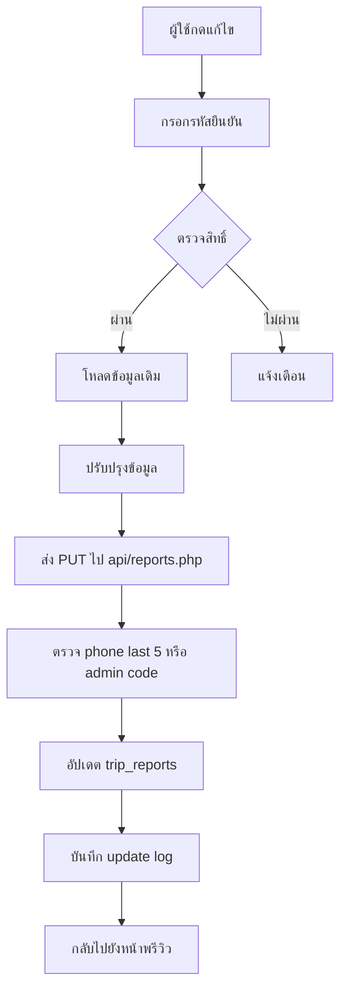
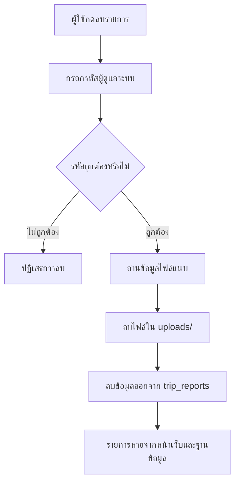
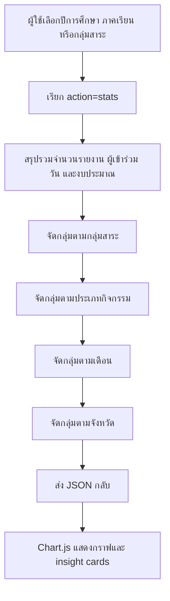
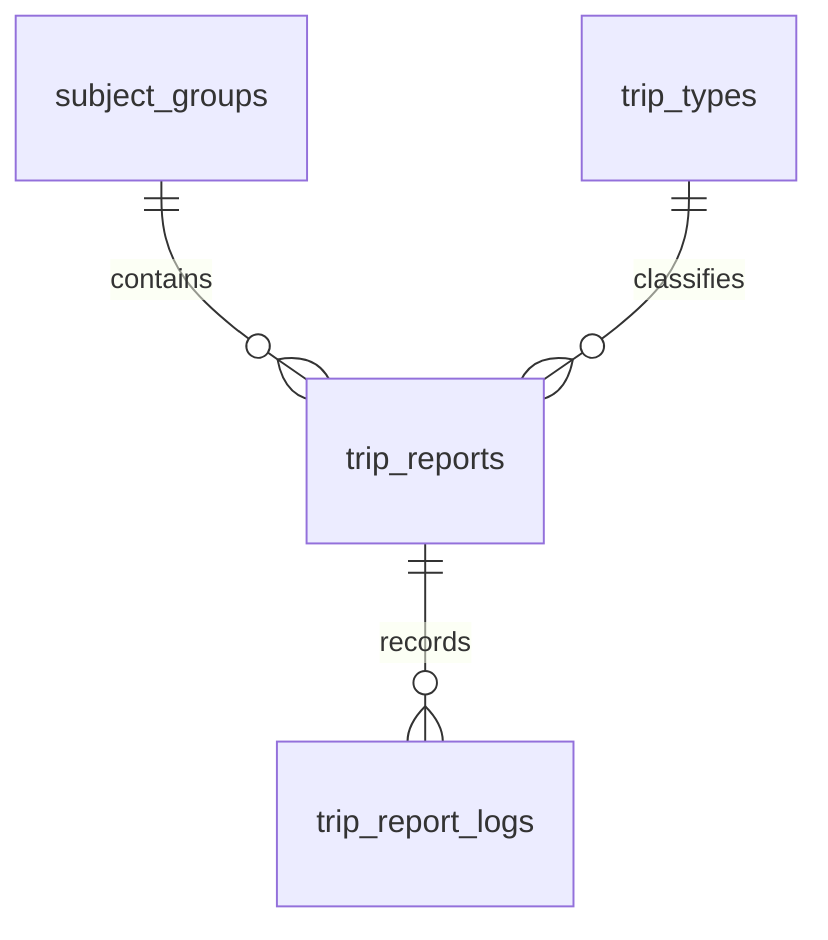

# 📘 ระบบรายงานไปราชการและการพัฒนาบุคลากร

ระบบนี้เป็นเว็บแอปพลิเคชันสำหรับบันทึก ติดตาม ค้นคืน และสรุปรายงานการไปราชการ การอบรม การสัมมนา และการพัฒนาตนเองของบุคลากรภายในสถานศึกษา โดยออกแบบให้รองรับการใช้งานผ่านเว็บเบราว์เซอร์แบบไม่ซับซ้อน ใช้งานได้ทันทีบนโครงสร้าง `PHP + MySQL + JavaScript` และเหมาะกับบริบทของหน่วยงานการศึกษาที่ต้องการลดภาระงานเอกสารและเพิ่มความถูกต้องของข้อมูลเชิงรายงาน

เอกสารฉบับนี้จัดทำขึ้นจากการวิเคราะห์พฤติกรรมจริงของระบบในรีโปปัจจุบัน เพื่อใช้เป็นเอกสารอ้างอิงเชิงเทคนิคและเชิงปฏิบัติการสำหรับผู้พัฒนา ผู้ดูแลระบบ และผู้ประเมินโครงการ รวมถึงรองรับการเผยแพร่บน GitHub ในลักษณะเอกสารประกอบระบบอย่างเป็นทางการ

## 🎯 1. วัตถุประสงค์ของระบบ

ระบบมีวัตถุประสงค์หลักดังต่อไปนี้

- รองรับการบันทึกรายงานการไปราชการ การประชุม การอบรม การสัมมนา และกิจกรรมพัฒนาวิชาชีพของบุคลากร
- จัดเก็บข้อมูลรายงานในรูปแบบดิจิทัลอย่างเป็นระบบและค้นคืนได้สะดวก
- ลดการจัดทำเอกสารซ้ำซ้อนและลดความเสี่ยงจากข้อมูลสูญหาย
- สนับสนุนการพิมพ์รายงานในรูปแบบที่พร้อมใช้งานทางราชการหรือแปลงเป็น PDF ได้ทันที
- สร้างสารสนเทศสรุปภาพรวมสำหรับผู้บริหารผ่านแดชบอร์ดและกราฟสถิติ
- รองรับการตรวจสอบย้อนหลังผ่านบันทึกการกระทำของผู้ใช้ในระดับรายการ

## 🧩 2. ขอบเขตการทำงานของระบบ

ระบบครอบคลุมการทำงานสำคัญ 5 ส่วน

1. การบันทึกรายงานใหม่
2. การอัปโหลดและบีบอัดภาพถ่ายประกอบ
3. การค้นหา กรอง ดูรายละเอียด และพิมพ์รายงาน
4. การแก้ไขหรือลบรายการด้วยกลไกยืนยันสิทธิ์ตามระดับที่กำหนด
5. การสรุปผลเชิงสถิติผ่านหน้าแดชบอร์ด

## 👥 3. ลักษณะการใช้งานและสิทธิ์

ระบบปัจจุบันไม่มีโมดูลเข้าสู่ระบบแบบบัญชีผู้ใช้แยกตามบทบาท แต่ใช้แนวคิดการยืนยันสิทธิ์ระดับรายการข้อมูลแทน โดยมีหลักการดังนี้

- ผู้ใช้งานทั่วไปสามารถบันทึกรายงานใหม่ได้จากหน้าแบบฟอร์ม
- การแก้ไขรายการใช้ข้อมูลยืนยันตัวตน 2 รูปแบบ
  - เบอร์โทรศัพท์ 5 หลักท้ายของผู้รายงาน
  - รหัสผู้ดูแลระบบ
- การลบรายการอนุญาตเฉพาะผู้ที่ทราบรหัสผู้ดูแลระบบเท่านั้น
- การเรียกดูข้อมูลรายงานและข้อมูลสถิติสามารถทำได้จากส่วนติดต่อผู้ใช้ของระบบโดยตรง

กล่าวโดยสรุป ระบบนี้เป็นระบบกึ่งสาธารณะในระดับองค์กร ที่ให้ความสำคัญกับความคล่องตัวในการใช้งานมากกว่าการจัดการสิทธิ์แบบบัญชีผู้ใช้เต็มรูปแบบ

## ⭐ 4. คุณลักษณะสำคัญของระบบ

- หน้าแดชบอร์ดสรุปจำนวนรายงาน ผู้เข้าร่วม งบประมาณ ประเภทกิจกรรม กลุ่มสาระ และจังหวัด
- แบบฟอร์มบันทึกรายงานที่แบ่งส่วนข้อมูลอย่างชัดเจน
- รองรับประเภทกิจกรรม เช่น ประชุม อบรม สัมมนา ศึกษาดูงาน และงานราชการอื่น
- รองรับการระบุกลุ่มสาระการเรียนรู้หรือฝ่ายงานของผู้รายงาน
- รองรับการระบุจำนวนผู้เข้าร่วมและรายชื่อผู้ร่วมเดินทาง
- รองรับการแนบภาพถ่ายประกอบ 2 ภาพแบบบังคับ
- บีบอัดภาพอัตโนมัติฝั่งเซิร์ฟเวอร์เพื่อลดขนาดไฟล์จัดเก็บ
- พรีวิวรายงานก่อนพิมพ์พร้อมรูปแบบเอกสาร A4
- ค้นหาและกรองรายการตามคำค้น กลุ่มสาระ ประเภท ปีการศึกษา ภาคเรียน และช่วงวันที่
- รองรับการลบข้อมูลพร้อมลบออกจากฐานข้อมูลจริงตามพฤติกรรมปัจจุบันของระบบ
- บันทึก log การสร้าง ดู แก้ไข และลบรายการ

## 🏗️ 5. โครงสร้างสถาปัตยกรรมระบบ

### 🧭 5.1 มุมมองสถาปัตยกรรมภาพรวม

ระบบใช้สถาปัตยกรรมแบบเว็บแอปพลิเคชัน 3 ชั้น ประกอบด้วยส่วนแสดงผล ส่วนตรรกะการทำงาน และส่วนฐานข้อมูล



### 🧱 5.2 คำอธิบายองค์ประกอบสถาปัตยกรรม

- ชั้นนำเสนอข้อมูล (Presentation Layer)
  - ใช้ไฟล์ `index.html` เป็น Single Page Application
  - แสดงผลด้วย Tailwind CSS ผ่าน CDN
  - ใช้ Font Awesome, Chart.js, SweetAlert2 และ Flatpickr
- ชั้นตรรกะฝั่งไคลเอนต์ (Client Logic Layer)
  - แยกเป็นโมดูล JavaScript ตามหน้าที่ เช่น แดชบอร์ด แบบฟอร์ม รายการ พรีวิว และแก้ไข
- ชั้นบริการข้อมูล (Application/API Layer)
  - ใช้ PHP สำหรับให้บริการ API แบบ JSON
  - `api/reports.php` รับผิดชอบ CRUD และสถิติ
  - `api/upload.php` รับผิดชอบอัปโหลดและบีบอัดภาพ
- ชั้นข้อมูล (Data Layer)
  - ใช้ MySQL/MariaDB ผ่าน PDO
  - จัดเก็บข้อมูลหลักในตารางรายงาน ตารางประเภท ตารางกลุ่มสาระ ตารางตั้งค่าระบบ และตารางบันทึกเหตุการณ์
- ชั้นจัดเก็บไฟล์ (File Storage Layer)
  - จัดเก็บไฟล์ภาพในไดเรกทอรี `uploads/`

### 📁 5.3 โครงสร้างแฟ้มภายในระบบ

```text
ct-idp/
├── index.html
├── config.php
├── install.php
├── database.sql
├── README.md
├── api/
│   ├── reports.php
│   └── upload.php
├── js/
│   ├── app.js
│   ├── dashboard.js
│   ├── form.js
│   ├── records.js
│   ├── preview.js
│   └── edit.js
├── logo/
│   └── logo.png
└── uploads/
```

## 🛠️ 6. เทคโนโลยีที่ใช้

| องค์ประกอบ | เทคโนโลยี | รายละเอียด |
|---|---|---|
| Frontend | HTML5 | โครงสร้างหน้าเว็บหลัก |
| Frontend | Tailwind CSS CDN | จัดรูปแบบส่วนติดต่อผู้ใช้ |
| Frontend | JavaScript (Vanilla) | จัดการ SPA routing, form logic, dashboard, preview |
| Frontend Library | Chart.js | แสดงกราฟสรุปเชิงสถิติ |
| Frontend Library | SweetAlert2 | กล่องโต้ตอบและยืนยันการทำรายการ |
| Frontend Library | Flatpickr Thai Locale | ตัวเลือกวันที่พร้อมรูปแบบภาษาไทย |
| Frontend Library | Font Awesome | ไอคอนในส่วนติดต่อผู้ใช้ |
| Backend | PHP 8.x | พัฒนา API และตรรกะฝั่งเซิร์ฟเวอร์ |
| Database | MySQL / MariaDB | จัดเก็บข้อมูลเชิงโครงสร้าง |
| Data Access | PDO | เชื่อมต่อฐานข้อมูลและจัดการ prepared statements |
| Image Processing | GD Library | ย่อขนาดและบีบอัดภาพก่อนบันทึก |
| Deployment | XAMPP / Shared Hosting | รองรับทั้งเครื่องพัฒนาและโฮสต์จริง |

## 🖥️ 7. หน้าการทำงานหลักของระบบ

### 📊 7.1 แดชบอร์ด

ใช้สำหรับแสดงภาพรวมของข้อมูลรายงานในปีการศึกษาและภาคเรียนที่เลือก เช่น

- จำนวนรายงานทั้งหมด
- งบประมาณรวมและงบโรงเรียนที่ใช้
- ประเภทกิจกรรมที่มีความถี่สูงสุด
- กลุ่มสาระหรือฝ่ายงานที่มีการรายงานมากที่สุด
- จังหวัดที่มีการเดินทางบ่อย
- กราฟรายเดือน กราฟตามประเภท และกราฟตามกลุ่มสาระ

### 📝 7.2 แบบฟอร์มบันทึกรายงาน

แบบฟอร์มแบ่งออกเป็น 5 หมวดข้อมูล

1. ข้อมูลผู้รายงาน
2. รายละเอียดกิจกรรม
3. ผู้เข้าร่วมและงบประมาณ
4. สาระสำคัญและผลการพัฒนา
5. ภาพถ่ายประกอบ

### 📚 7.3 รายการทั้งหมด

ใช้สำหรับสืบค้นและจัดการข้อมูลที่เคยบันทึกแล้ว โดยมีความสามารถดังนี้

- ค้นหาจากชื่อผู้รายงาน ชื่อกิจกรรม สถานที่ หรือหน่วยงานผู้จัด
- กรองตามกลุ่มสาระ ประเภทกิจกรรม ปีการศึกษา ภาคเรียน และช่วงวันที่
- เปิดพรีวิวรายงาน
- เรียกกระบวนการแก้ไข
- เรียกกระบวนการลบ

### 🖨️ 7.4 พรีวิวรายงาน

ใช้แสดงผลรายงานในรูปแบบเอกสารเพื่อ

- ตรวจสอบความถูกต้องก่อนพิมพ์
- พิมพ์เอกสารหรือบันทึกเป็น PDF
- เข้าสู่กระบวนการแก้ไขจากรายการที่กำลังดูอยู่

### ✏️ 7.5 หน้าแก้ไขข้อมูล

ใช้สำหรับปรับปรุงข้อมูลเดิมของรายงานที่มีอยู่แล้ว โดยต้องผ่านการยืนยันตัวตนก่อนทุกครั้ง

## 🔄 8. โฟลว์การทำงานของแต่ละส่วน

### 🚀 8.1 โฟลว์การบันทึกรายงานใหม่



ลำดับการทำงานเชิงตรรกะมีดังนี้

1. ผู้ใช้กรอกข้อมูลผู้รายงาน รายละเอียดกิจกรรม ผู้เข้าร่วม งบประมาณ และข้อมูลเชิงเนื้อหา
2. ระบบตรวจว่ามีภาพถ่ายประกอบครบ 2 ภาพหรือไม่
3. ระบบอัปโหลดภาพแต่ละภาพไปยัง `api/upload.php`
4. เซิร์ฟเวอร์ตรวจชนิดไฟล์ ย่อขนาด และบีบอัดภาพให้มีขนาดเหมาะสม
5. เมื่อได้ URL ของภาพครบแล้ว ฝั่งไคลเอนต์จึงส่งข้อมูลรายงานไปยัง `api/reports.php`
6. เซิร์ฟเวอร์สร้างเลขที่รายงาน คำนวณจำนวนวัน และกำหนดปีการศึกษา/ภาคเรียน
7. ระบบบันทึกข้อมูลลงฐานข้อมูลพร้อมบันทึกประวัติการสร้างรายการ

### 👀 8.2 โฟลว์การดูรายการและพรีวิว



### ✍️ 8.3 โฟลว์การแก้ไขรายงาน



หลักเกณฑ์การยืนยันตัวตนมีดังนี้

- ถ้าผู้ใช้กรอกเบอร์โทร 5 หลักท้ายตรงกับข้อมูลที่บันทึกไว้ จะสามารถแก้ไขรายการได้
- ถ้าผู้ใช้กรอกรหัสผู้ดูแลระบบ จะถือว่ามีสิทธิ์แก้ไขรายการได้เช่นกัน

### 🗑️ 8.4 โฟลว์การลบรายงาน



หมายเหตุสำคัญ: การลบในระบบปัจจุบันเป็นการลบจริงจากฐานข้อมูล (hard delete) และไฟล์ภาพแนบจะถูกลบจริงจากระบบไฟล์ด้วย

### 📈 8.5 โฟลว์การสร้างแดชบอร์ดสถิติ



## 🔌 9. รายละเอียด API

### 📡 9.1 `api/reports.php`

| Method | Action | วัตถุประสงค์ |
|---|---|---|
| `GET` | `list` | ดึงรายการรายงานแบบมีตัวกรองและแบ่งหน้า |
| `GET` | `single` | ดึงข้อมูลรายงาน 1 รายการ |
| `GET` | `stats` | ดึงข้อมูลสรุปเชิงสถิติสำหรับแดชบอร์ด |
| `GET` | `options` | ดึงข้อมูลกลุ่มสาระ ประเภทกิจกรรม และปีการศึกษา |
| `POST` | - | สร้างรายงานใหม่ |
| `PUT` | - | แก้ไขรายงานเดิม |
| `DELETE` | - | ลบรายงานออกจากฐานข้อมูลจริง |

### 🖼️ 9.2 `api/upload.php`

ใช้สำหรับอัปโหลดภาพประกอบรายงาน โดยมีหลักการทำงานดังนี้

- รับไฟล์ภาพผ่าน `multipart/form-data`
- รองรับ `JPG`, `PNG`, `WEBP`, `GIF`, `BMP`, `TIFF`, `AVIF`, `HEIC`, `SVG`
- ตรวจ MIME type จากไฟล์จริง
- ย่อขนาดภาพไม่ให้มีด้านใดยาวเกิน 2000 พิกเซล
- บีบอัดภาพเป็น JPEG โดยตั้งเป้าไม่เกินประมาณ 300 KB
- บันทึกไฟล์ลงใน `uploads/`
- ส่งกลับ URL สำหรับอ้างอิงในรายงาน

## 🗃️ 10. Data Dictionary

### 🏷️ 10.1 ตาราง `subject_groups`

ใช้เก็บกลุ่มสาระการเรียนรู้หรือฝ่ายงานของผู้รายงาน

| ฟิลด์ | ชนิดข้อมูล | ความหมาย |
|---|---|---|
| `id` | `INT` | รหัสกลุ่มสาระ/ฝ่ายงาน |
| `name` | `VARCHAR(100)` | ชื่อเต็มของกลุ่มสาระหรือฝ่าย |
| `short_name` | `VARCHAR(30)` | ชื่อย่อสำหรับแสดงผล |
| `color` | `VARCHAR(20)` | สีประจำกลุ่ม ใช้ใน badge และกราฟ |
| `icon` | `VARCHAR(50)` | ชื่อไอคอนสำหรับ UI |
| `sort_order` | `INT` | ลำดับการแสดงผล |
| `is_active` | `TINYINT(1)` | สถานะการเปิดใช้งาน |
| `created_at` | `TIMESTAMP` | วันเวลาที่สร้างข้อมูล |
| `updated_at` | `TIMESTAMP` | วันเวลาที่แก้ไขล่าสุด |

### 🧾 10.2 ตาราง `trip_types`

ใช้เก็บประเภทของการไปราชการหรือกิจกรรมพัฒนา

| ฟิลด์ | ชนิดข้อมูล | ความหมาย |
|---|---|---|
| `id` | `INT` | รหัสประเภทกิจกรรม |
| `name` | `VARCHAR(100)` | ชื่อประเภท เช่น ประชุม อบรม สัมมนา |
| `icon` | `VARCHAR(50)` | ชื่อไอคอน |
| `sort_order` | `INT` | ลำดับการแสดงผล |
| `is_active` | `TINYINT(1)` | สถานะการใช้งาน |

### 📄 10.3 ตาราง `trip_reports`

เป็นตารางหลักของระบบ ใช้เก็บข้อมูลรายงานแต่ละรายการ

| ฟิลด์ | ชนิดข้อมูล | ความหมาย |
|---|---|---|
| `id` | `INT` | Primary key ของรายงาน |
| `report_no` | `VARCHAR(30)` | เลขที่รายงานที่ระบบสร้างอัตโนมัติ |
| `reporter_name` | `VARCHAR(150)` | ชื่อผู้รายงาน |
| `reporter_position` | `VARCHAR(150)` | ตำแหน่งผู้รายงาน |
| `reporter_phone` | `VARCHAR(20)` | เบอร์โทรศัพท์ผู้รายงาน |
| `reporter_phone_last5` | `VARCHAR(5)` | เก็บ 5 หลักท้ายเพื่อใช้ยืนยันการแก้ไข |
| `subject_group_id` | `INT` | อ้างอิงกลุ่มสาระ/ฝ่ายงาน |
| `trip_type_id` | `INT` | อ้างอิงประเภทกิจกรรม |
| `trip_type_other` | `VARCHAR(200)` | ใช้เก็บกรณีระบุประเภทอื่น |
| `activity_name` | `VARCHAR(500)` | ชื่อกิจกรรมหรือหลักสูตร |
| `organizer` | `VARCHAR(300)` | หน่วยงานผู้จัด |
| `venue` | `VARCHAR(300)` | สถานที่จัด |
| `province` | `VARCHAR(100)` | จังหวัดที่จัดกิจกรรม |
| `start_date` | `DATE` | วันที่เริ่มต้น |
| `end_date` | `DATE` | วันที่สิ้นสุด |
| `total_days` | `INT` | จำนวนวันของกิจกรรม |
| `fiscal_year` | `INT` | ปีการศึกษาหรือปีที่ใช้สรุปข้อมูลตามตรรกะระบบ |
| `semester` | `TINYINT` | ภาคเรียนที่ระบบคำนวณจากเดือน |
| `participants_count` | `INT` | จำนวนผู้เข้าร่วมทั้งหมด |
| `participants_list` | `JSON` | รายชื่อผู้ร่วมเดินทาง |
| `objectives` | `TEXT` | วัตถุประสงค์ |
| `content_summary` | `TEXT` | สาระสำคัญที่ได้รับ |
| `knowledge_gained` | `TEXT` | ความรู้หรือทักษะที่ได้รับ |
| `application_plan` | `TEXT` | แนวทางการนำไปใช้ |
| `problems_obstacles` | `TEXT` | ปัญหาและอุปสรรค |
| `suggestions` | `TEXT` | ข้อเสนอแนะ |
| `budget_type` | `ENUM` | ประเภทแหล่งงบประมาณ |
| `budget_amount` | `DECIMAL(12,2)` | จำนวนเงินงบประมาณ |
| `attachments` | `JSON` | รายการไฟล์ภาพประกอบ |
| `status` | `ENUM` | สถานะรายการ ปัจจุบันใช้ค่าเริ่มต้น `submitted` |
| `ip_address` | `VARCHAR(45)` | IP ของผู้ส่งข้อมูล |
| `user_agent` | `TEXT` | User agent ของเบราว์เซอร์ |
| `created_at` | `TIMESTAMP` | วันที่สร้างรายการ |
| `updated_at` | `TIMESTAMP` | วันที่แก้ไขล่าสุด |
| `deleted_at` | `TIMESTAMP NULL` | ฟิลด์เดิมจากโครงสร้างฐานข้อมูล ใช้เพื่อรองรับการออกแบบเดิม |

### 📜 10.4 ตาราง `trip_report_logs`

ใช้บันทึกประวัติการกระทำกับรายงาน

| ฟิลด์ | ชนิดข้อมูล | ความหมาย |
|---|---|---|
| `id` | `INT` | Primary key |
| `report_id` | `INT` | อ้างอิงไปยังรายงาน |
| `action` | `ENUM` | ประเภทการกระทำ เช่น `create`, `view`, `update`, `delete` |
| `changed_by` | `VARCHAR(150)` | ชื่อผู้ที่กระทำรายการ |
| `changed_fields` | `JSON` | ฟิลด์ที่แก้ไข ปัจจุบันยังไม่ได้ใช้เต็มรูปแบบ |
| `auth_method` | `ENUM` | วิธีที่ใช้ยืนยันสิทธิ์ เช่น `phone`, `admin_code` |
| `ip_address` | `VARCHAR(45)` | IP ของผู้ทำรายการ |
| `created_at` | `TIMESTAMP` | วันเวลาที่บันทึก log |

### ⚙️ 10.5 ตาราง `system_settings`

ใช้เก็บค่ากำหนดของระบบ

| ฟิลด์ | ชนิดข้อมูล | ความหมาย |
|---|---|---|
| `id` | `INT` | Primary key |
| `setting_key` | `VARCHAR(100)` | ชื่อคีย์การตั้งค่า |
| `setting_value` | `TEXT` | ค่าการตั้งค่า |
| `description` | `VARCHAR(300)` | คำอธิบายเพิ่มเติม |
| `updated_at` | `TIMESTAMP` | วันเวลาที่แก้ไขล่าสุด |

## 🔗 11. ความสัมพันธ์ของข้อมูล



คำอธิบายความสัมพันธ์

- หนึ่งกลุ่มสาระหรือฝ่ายงานสามารถมีรายงานได้หลายรายการ
- หนึ่งประเภทกิจกรรมสามารถถูกใช้อ้างอิงในรายงานได้หลายรายการ
- หนึ่งรายงานสามารถมีประวัติการกระทำหลายรายการ

## 📌 12. กติกาทางธุรกิจที่สำคัญ

- ต้องกรอก `reporter_name`, `reporter_phone`, `activity_name`, `start_date`, และ `end_date`
- วันที่เริ่มต้นต้องไม่มากกว่าวันที่สิ้นสุด
- การแนบภาพประกอบถือเป็นเงื่อนไขบังคับ 2 ภาพในกระบวนการบันทึกรายการใหม่
- จำนวนวันคำนวณจากผลต่างระหว่างวันเริ่มต้นและวันสิ้นสุดแบบนับรวมวันแรกและวันสุดท้าย
- จำนวนผู้เข้าร่วมจะใช้ค่าที่มากกว่าระหว่างจำนวนที่กรอกกับจำนวนรายชื่อผู้ร่วมเดินทางบวกผู้รายงาน 1 คน
- การแก้ไขข้อมูลต้องผ่านการยืนยันด้วยเบอร์โทร 5 หลักท้ายหรือรหัสผู้ดูแลระบบ
- การลบข้อมูลต้องใช้รหัสผู้ดูแลระบบเท่านั้น
- การลบข้อมูลในเวอร์ชันปัจจุบันเป็นการลบจริงจากฐานข้อมูล ไม่ใช่การซ่อนข้อมูล

## 🚀 13. ขั้นตอนการติดตั้งและใช้งาน

### 🧰 13.1 ความต้องการของระบบ

- PHP 8.x
- MySQL หรือ MariaDB
- เปิดใช้งาน PHP PDO MySQL
- เปิดใช้งาน GD Library
- เว็บเซิร์ฟเวอร์ เช่น Apache ผ่าน XAMPP

### 🪄 13.2 ขั้นตอนติดตั้ง

1. วางโครงการไว้ใน web root ของเซิร์ฟเวอร์
2. สร้างฐานข้อมูลชื่อ `goout_report` หรือใช้ไฟล์ `install.php`
3. ปรับค่าการเชื่อมต่อฐานข้อมูลใน `config.php` ให้ตรงกับสภาพแวดล้อม
4. เปิด `install.php` ผ่านเบราว์เซอร์เพื่อสร้างตารางและข้อมูลตั้งต้น
5. ตรวจสอบว่าโฟลเดอร์ `uploads/` สามารถเขียนไฟล์ได้
6. เปิดใช้งานระบบผ่าน `index.html`

### 🗄️ 13.3 การตั้งค่าฐานข้อมูลแบบนำเข้าเอง

หากไม่ใช้ `install.php` สามารถนำเข้าไฟล์ `database.sql` ได้โดยตรง จากนั้นตรวจสอบว่ามีข้อมูลตั้งต้นในตารางต่อไปนี้

- `subject_groups`
- `trip_types`
- `system_settings`

## 🔎 14. ข้อสังเกตเชิงเทคนิคจากเวอร์ชันปัจจุบัน

จากการตรวจสอบโค้ดในรีโป พบประเด็นที่ควรทราบเพื่อการพัฒนาและบำรุงรักษาต่อไปดังนี้

- ระบบใช้ค่าปีการศึกษา `2569` แบบตรึงค่าในหลายตำแหน่งของโค้ด เช่น การคำนวณปีและตัวเลือกในแดชบอร์ด
- ข้อมูลตั้งต้นใน `install.php` และ `database.sql` บางส่วนยังระบุ `current_fiscal_year` เป็น `2568` จึงอาจทำให้เอกสารอ้างอิงและค่าจริงไม่สอดคล้องกัน
- ฟิลด์ `status` ในตาราง `trip_reports` ถูกเตรียมไว้ แต่ในพฤติกรรมปัจจุบันใช้ค่าเริ่มต้น `submitted` เป็นหลัก ยังไม่มี workflow การอนุมัติเต็มรูปแบบ
- ฟิลด์ `changed_fields` ในตาราง `trip_report_logs` มีไว้รองรับการติดตามรายละเอียดการเปลี่ยนแปลง แต่ปัจจุบันยังไม่ได้บันทึก diff ของข้อมูลจริง
- การยืนยันสิทธิ์ยังเป็นแบบ shared secret และข้อมูลเบอร์โทร ไม่ใช่ระบบ session-based authentication
- หน้าเว็บอ้างอิงไลบรารีจาก CDN จึงต้องอาศัยการเชื่อมต่อเครือข่ายสำหรับการแสดงผลที่สมบูรณ์

## 💡 15. แนวทางพัฒนาต่อยอด

- เพิ่มระบบผู้ใช้และสิทธิ์แบบ role-based access control
- เพิ่ม workflow การตรวจสอบ รับทราบ และอนุมัติรายงาน
- เชื่อมค่าปีการศึกษาและข้อมูลโรงเรียนเข้ากับ `system_settings` แบบ dynamic เต็มรูปแบบ
- เพิ่มระบบส่งออกข้อมูลเป็น Excel หรือ CSV
- เพิ่มแดชบอร์ดเชิงเปรียบเทียบรายบุคคล รายกลุ่มสาระ และรายช่วงเวลา
- เพิ่ม audit trail ที่บันทึกรายละเอียด field-level changes
- เพิ่มระบบสำรองไฟล์แนบและการจัดเก็บแบบ object storage

## ✅ 16. สรุป

ระบบรายงานไปราชการและการพัฒนาบุคลากรในรีโปนี้เป็นระบบที่มีโครงสร้างเรียบง่าย แต่ครอบคลุมวงจรการทำงานสำคัญตั้งแต่การบันทึกรายงาน การแนบหลักฐาน การสืบค้น การพิมพ์ และการสรุปผลเชิงบริหาร โดยใช้เทคโนโลยีพื้นฐานที่ดูแลรักษาได้ง่าย เหมาะสำหรับการใช้งานภายในหน่วยงานการศึกษา และสามารถต่อยอดไปสู่ระบบสารสนเทศด้านบุคลากรที่มีความสมบูรณ์ยิ่งขึ้นได้ในอนาคต
# code-ct-idp
